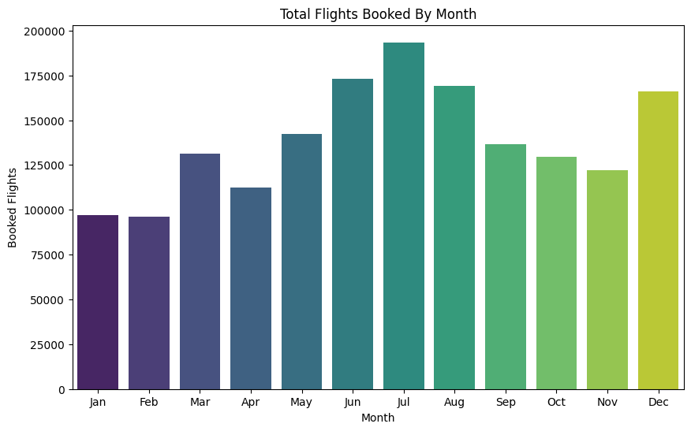
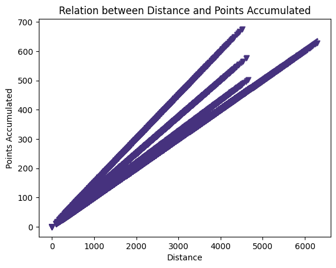
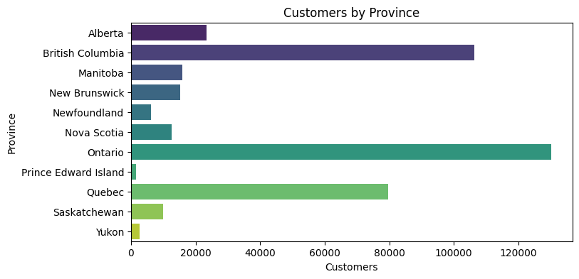
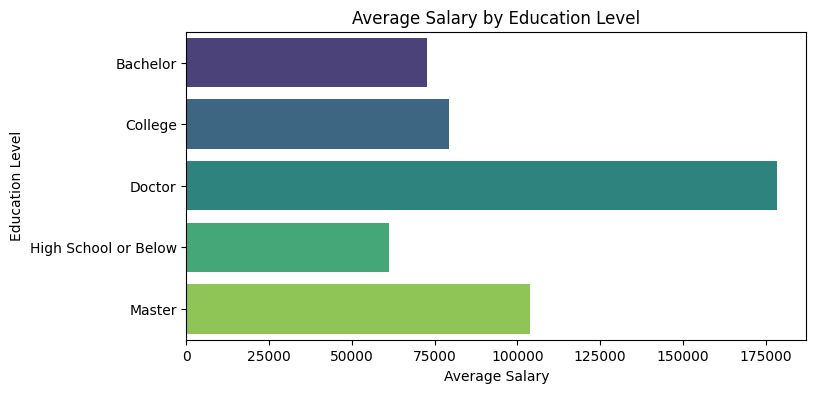
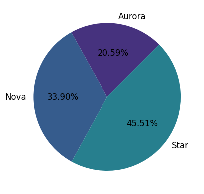
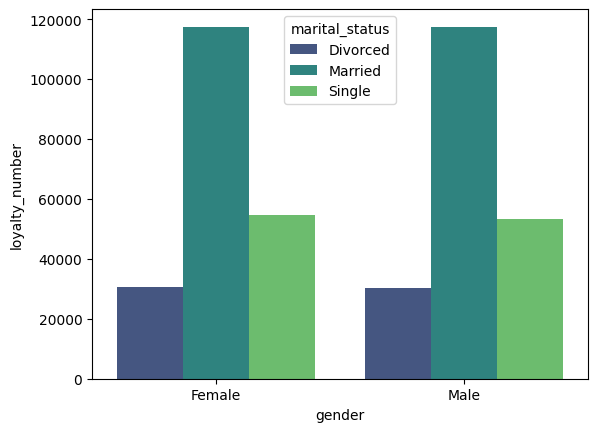

# Customer Loyalty Program Analysis

Este repositorio contiene un análisis de datos sobre el comportamiento de los clientes dentro de un programa de lealtad de una aerolínea. Los datos proporcionados incluyen información sobre las actividades de los clientes, como vuelos reservados, distancia volada, puntos acumulados y redimidos, ingresos, nivel educativo, estado civil, y más.

El objetivo principal de este análisis es explorar los datos de los clientes, realizar visualizaciones descriptivas y, además, realizar una prueba de hipótesis para evaluar si existen diferencias significativas en el número de vuelos reservados entre los diferentes niveles educativos.

## Descripción de los Archivos

El análisis se realizó utilizando dos archivos de datos:

### 1. **Customer Flight Analysis.csv**

Este archivo contiene información sobre la actividad de vuelos de los clientes, incluyendo:

- **Loyalty Number**: Identificador único para cada cliente.
- **Year**: Año en que se registraron las actividades de vuelo.
- **Month**: Mes del año (de 1 a 12).
- **Flights Booked**: Número total de vuelos reservados por el cliente en ese mes.
- **Flights with Companions**: Número de vuelos reservados en los cuales el cliente viajó con acompañantes.
- **Total Flights**: Total de vuelos que el cliente ha realizado hasta el momento.
- **Distance**: Distancia total volada en el mes.
- **Points Accumulated**: Puntos acumulados por el cliente en el programa de lealtad durante el mes.
- **Points Redeemed**: Puntos que el cliente ha redimido durante el mes.
- **Dollar Cost Points Redeemed**: Valor en dólares de los puntos redimidos.

### 2. **Customer Loyalty History.csv**

Este archivo proporciona información detallada sobre el perfil de los clientes, incluyendo:

- **Loyalty Number**: Identificador único para cada cliente.
- **Country**: País de residencia del cliente.
- **Province**: Provincia o estado de residencia del cliente.
- **City**: Ciudad de residencia.
- **Postal Code**: Código postal del cliente.
- **Gender**: Género del cliente (Male/Female).
- **Education**: Nivel educativo del cliente (ej. Bachelor, College, Doctor, etc.).
- **Salary**: Ingreso anual estimado del cliente.
- **Marital Status**: Estado civil del cliente (Single, Married, Divorced, etc.).
- **Loyalty Card**: Tipo de tarjeta de lealtad.
- **CLV (Customer Lifetime Value)**: Valor total estimado que el cliente aportará a la empresa.
- **Enrollment Type**: Tipo de inscripción en el programa de lealtad.
- **Enrollment Year**: Año de inscripción en el programa de lealtad.
- **Enrollment Month**: Mes de inscripción en el programa de lealtad.
- **Cancellation Year**: Año en que el cliente canceló su membresía, si aplica.
- **Cancellation Month**: Mes en que el cliente canceló su membresía, si aplica.

## Fase 1: Exploración y Limpieza de Datos

### 1. **Exploración Inicial**

Durante la fase de exploración, se identificaron posibles problemas en los datos, tales como valores nulos, atípicos y la estructura de las columnas. Se realizaron las siguientes acciones:

- **Revisión de valores negativos, nulos y duplicados**
- **Detección de valores atípicos** en las variables numéricas.
- **Inspección de la estructura de los datos**, asegurando que los tipos de datos sean correctos (por ejemplo, fechas, valores numéricos, etc.).

### 2. **Limpieza de Datos**

- Se **trataron los valores nulos** y se rellenaron con valores apropiados cuando fue necesario.
- Se **eliminaron las filas duplicadas**.
- Se **realizó la conversión de tipos de datos** para asegurar que las variables fueran adecuadas para el análisis.

### 3. **Unión de los Datos**

Se unieron ambos conjuntos de datos (`Customer Flight Analysis.csv` y `Customer Loyalty History.csv`) con un `left merge` utilizando la columna **loyalty_number**, para tener un solo DataFrame con la información completa de cada cliente (`customer_final.csv`).

## Fase 2: Visualización

Se crearon varias visualizaciones utilizando herramientas como `matplotlib` y `seaborn` para responder a las siguientes preguntas:

1. **¿Cómo se distribuye la cantidad de vuelos reservados por mes durante el año?**
   Se utilizó un gráfico de barras para mostrar la diferencia entre los vuelos reservados cada mes.
   
   
2. **¿Existe una relación entre la distancia de los vuelos y los puntos acumulados por los clientes?**
   Se realizó un gráfico de dispersión para visualizar la correlación entre la distancia y los puntos acumulados.
   

3. **¿Cuál es la distribución de los clientes por provincia o estado?**
   Se usó un gráfico de barras horizontal para mostrar la cantidad de clientes por provincia.
   
4. **¿Cómo se compara el salario promedio entre los diferentes niveles educativos de los clientes?**
   Se realizó un gráfico de barras horizontal para comparar la distribución de los salarios entre los distintos niveles educativos.
   
5. **¿Cuál es la proporción de clientes con diferentes tipos de tarjetas de fidelidad?**
   Se usó un gráfico circular (pie chart) para representar la proporción de clientes con distintos tipos de tarjetas de lealtad.
   
6. **¿Cómo se distribuyen los clientes según su estado civil y género?**
   Se utilizó un gráfico de barras agrupadas para mostrar la distribución de clientes según estado civil y género.
   

## Fase 3: Evaluación de Diferencias en Reservas de Vuelos por Nivel Educativo (A/B Testing)

### 1. **Preparación de Datos**

Para evaluar si existen diferencias significativas en el número de vuelos reservados según el nivel educativo de los clientes, se filtraron los datos relevantes:

- **Columnas seleccionadas**: `flights_booked`, `education`.

### 2. **Análisis Descriptivo**

Se calcularon estadísticas descriptivas (promedio, desviación estándar, etc.) del número de vuelos reservados para cada nivel educativo.

### 3. **Prueba de Hipótesis (Mann-Whitney U Test)**

Se aplicó una prueba de **Mann-Whitney U** para comparar las reservas de vuelos entre los grupos de educación universitaria y no universitaria (`university` vs `non_university`), con el objetivo de determinar si hay una diferencia estadísticamente significativa en el número de vuelos reservados por cada grupo.

## Conclusiones

- **Distribución de vuelos**: Se observó que los vuelos reservados tienen una distribución variable a lo largo del año, con picos en ciertos meses.
- **Relación entre distancia y puntos**: Se encontró una relación positiva entre la distancia volada y los puntos acumulados.
- **Diferencias entre grupos educativos**: La prueba de Mann-Whitney U indicó que sí existe una diferencia significativa entre el número de vuelos reservados por el grupo de univeritarios y el de no universitarios.

## Herramientas y Librerías Utilizadas

Para llevar a cabo este análisis, se han utilizado varias librerías de Python, las cuales proporcionan las funciones necesarias para la manipulación de datos, visualización y realización de pruebas estadísticas.

### Librerías Principales

1. **Pandas**:  
   Librería principal para la manipulación y análisis de datos. Se utilizó para cargar los archivos CSV, realizar transformaciones de los datos y agruparlos según las necesidades del análisis.  
   - Instalación: `pip install pandas`

2. **NumPy**:  
   Librería para el manejo de arreglos y operaciones numéricas, que se utilizó principalmente para realizar cálculos estadísticos y manipular los datos en arrays.  
   - Instalación: `pip install numpy`

3. **Matplotlib**:  
   Librería para crear gráficos estáticos, visualizaciones y plots. Se utilizó para crear gráficos de líneas, barras, y boxplots que permiten observar tendencias y comparaciones entre los datos.  
   - Instalación: `pip install matplotlib`

4. **Seaborn**:  
   Librería basada en Matplotlib, que facilita la creación de gráficos estadísticos de alto nivel. Fue utilizada para crear gráficos visualmente atractivos y con mayor capacidad de personalización.  
   - Instalación: `pip install seaborn`

5. **SciPy**:  
   Librería utilizada para realizar pruebas estadísticas. En este caso, se utilizó el **Mann-Whitney U Test** para evaluar si existen diferencias significativas entre los grupos educativos en cuanto a los vuelos reservados.  
   - Instalación: `pip install scipy`

## Autora

- Rosana Lara Fernández

Si tienes alguna pregunta o necesitas más información, no dudes en contactarme: larafernandezrosana@gmail.com

